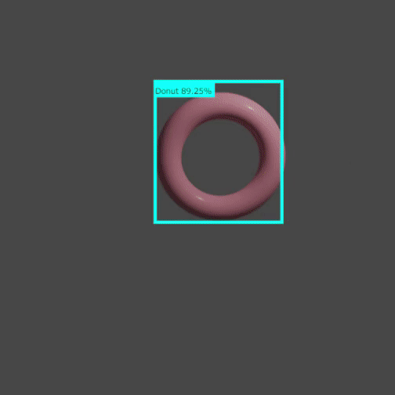

This repository is my the first test of generating synthetic dataset with Blender and train ML model with them. Generating a torus in Blender and generated annoations and photos with several parameters (color, position, rotation).

This is build base on the procedure of this article.
https://blog.tensorflow.org/2021/01/custom-object-detection-in-browser.html

The model showed good predictions for the test dataset. But it do not work with camera images.

# Tips
In the article of kangaroo detection, the model is trained in 7500 steps but it's too many for this.
1000 is enough. Check `tensorboard` to see the training procision.